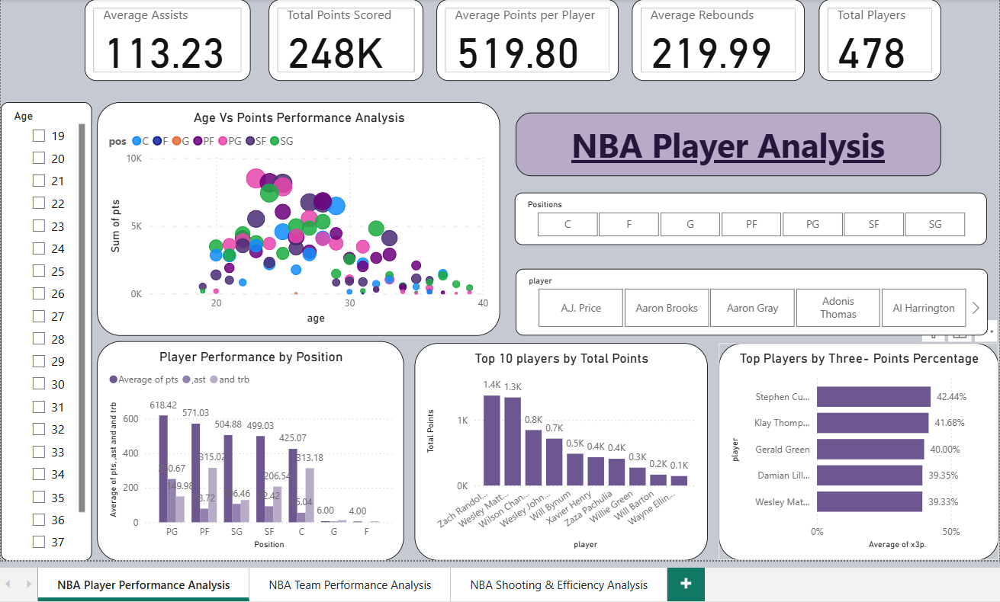
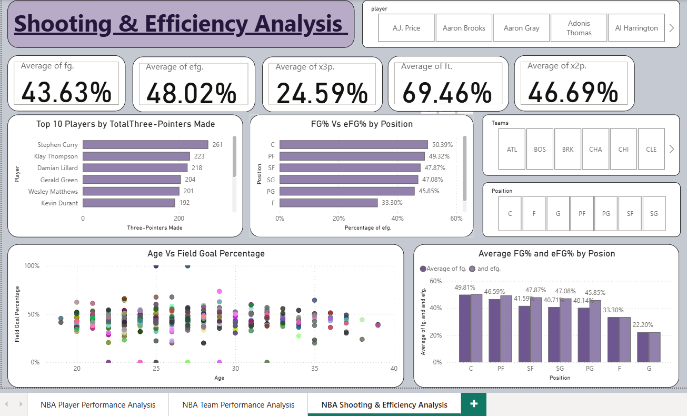

# NBA Player Performance Analysis Dashboard

## Overview
This project is an interactive **Power BI Dashbord** developed to analyze NBA player and team performance using Bussiness Intelligence techniques.
The dashboard transforms raw NBA statistics into meaningful insights through interactive visualization, KPI cards, Dax measures, and data storytelling.

## Business Problem
NBA player statistics contain thousand of record, making it difficult to identify top-perfoming players, compare teams, and evaluate shooting efficiency.
This dashboard help users make data-driven decision by providing interactive analysis of player performance, team performance, and shooting efficiency.

### Player Performance Analysis

- Total Player
- Total Points
- Average Points
- Average Assists
- Average Rebounds
- Top 10 Players
- Top 3-Points shooters
- Age Vs Points Analysis 

### Team Performance Analysis 

- Team Performance
- Rebound Efficiency
- Average FG%
- Team Comparison
- 2P vs 3P Analysis
  
### Shooting & Efficiency Analysis 

- FG% 
- eFG%
- FT%
- 2P%
- Position-wise shooting Analysis
- Age Vs FG%

## Tools Used
- Power BI
- Power Query
- Dax

## Dataset 
- 478 NBA Players
- 31 NBA Teams

## Key Insights
- Players aged 24-29 contibute the highest scoring performance.
- Points Guards lead in assists.
- Centers dominate rebounding efficiency.
- eFG% is a better indicator of shooting efficiency than FG%.
- Teams with center rebounding generate more scoring opportunities.

## Project Report
A detailed project report is available in this repository.

Auther 
**Nakul Borkute**

